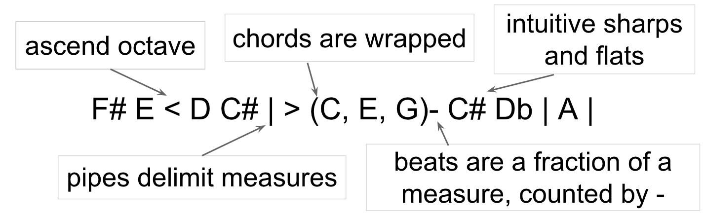

### Documentation
---
#### Importing Tambourine Module
Download Tambourine files and place create your `song.js` file in the same directory.

Import module into `song.js` with the line

	var Q = require('./Tambourine.js');
	
#### Declaring Synth Settings
The sound of the instrument can be set using the methods `setSynth` and `setEnv`.
###### setSynth
`setSynth(SynthType.PLUCK, feedback, multiplier)`

synthType can be either **PLUCK** or **SIN**

###### setEnv
Set the characteristics of the sound.

`setEnv(attack, decay, sustain, release)`

#### Declaring Global Sound Settings
Global sound settings will be used as defaults by individual melodies. These settings include:

1. time
2. tempo
3. volume
4. octave

and can be modified by the functions:

	setGlobalTime(time)
	setGlobalTempo(tempo)
	setGlobalVolume(volume)
	setGlobalOctave(octave)

#### Creating Melodies
Declare melodies as JS objects with the method `createMelody`. Provide music notes as a string parameter in the Tambourine musical syntax.

`createMelody(notes, tempo, volume, octave)`

	var m1 = Q.createMelody("C D E F G |");
	m1 = 80;
	m1 = 8;
	m1 = 4;
	
	var m2 = Q.createMelody("C D E F G|", 80, 8, 4);
	
Melodies have the following properties can be set or passed in as parameters: 

1. **tempo** : integer representing beats/min
2. **volume** : integer representing volume
3. **octave** : integer representing octave 

Melodies can be set to repeat several times with the function `repeat(numRepeats)`
	
	m1.repeat(2);
	
#### Playing Melodies
Melodies can be combined and played simultaneously with Tambourine's `play` method.
	
	Q.play([m1,m2]);
	
#### Musical Syntax

